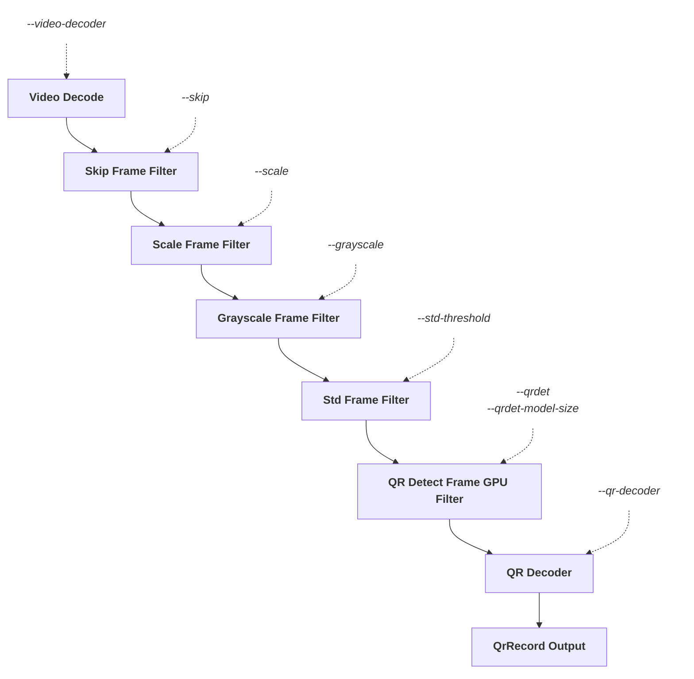

# QR Parse Tool Specification

## Overview

`qr-parse` (exposed via `reprostim parse-qr`) processes recorded video files to detect and extract
QR code data embedded in the video frames. It outputs timing and payload information for each QR
code found, enabling downstream tools to correlate stimulus events with video timestamps.

The core loop reads frames from an MKV/video file using OpenCV (`cv2.VideoCapture`), converts each
frame to grayscale, and attempts QR code detection via `pyzbar`. Detected codes are deduplicated
(consecutive frames showing the same QR are collapsed into a single record) and written to a
structured log/output.

---

## CLI Interface

```
reprostim qr-parse [OPTIONS] PATH
```

### Arguments

| Argument | Description                                                                                                                           |
|----------|---------------------------------------------------------------------------------------------------------------------------------------|
| `PATH`   | Path to a video file (`.mkv`) to parse in `PARSE` mode, or a video file or directory containing video files in `INFO` mode. Required. |

### Options

| Option                      | Type   | Default | Description                                                                                                                                                                                                                                                                                                                                                    |
|-----------------------------|--------|---------|----------------------------------------------------------------------------------------------------------------------------------------------------------------------------------------------------------------------------------------------------------------------------------------------------------------------------------------------------------------|
| `-m / --mode [PARSE\|INFO]` | Choice | `PARSE` | Execution mode. `PARSE` reads frames, extracts QR codes, and outputs one JSONL record per detected code. `INFO` dumps file-level metadata (duration, bitrate, size) for the given video file or all `.mkv` files in a directory.                                                                                                                               |
| `-g / --grayscale [none\|numpy\|opencv]`   | str   | `opencv`   | Grayscale conversion method applied to each frame before QR decoding. `opencv` uses `cv2.cvtColor(frame, cv2.COLOR_BGR2GRAY)` (fastest, recommended). `numpy` uses `np.mean(frame, axis=2)` (slow, legacy). `none` passes the raw frame directly — may cause runtime errors with decoders that expect a single-channel image.                              |
| `-t / --std-threshold FLOAT` | Float | `10.0`  | Grayscale std-deviation pre-filter threshold. When `> 0`, frames whose grayscale std deviation is below this value are skipped before calling QR decoder (cheap blank-frame filter). Set to `0` or less to disable the filter entirely and decode every frame. Frames with a QR code typically have std dev 40-80+; plain-content frames ~22; blank frames ~2.5. |
| `-x / --scale FLOAT`         | Float | `1.0`   | Frame downscale factor in the range `(0, 1]`. Applied before QR decode. At `0.5` frame area is reduced to 25%, significantly cutting decode cost. At `1.0` (default) no resize is performed. Values outside `(0, 1]` are invalid.                                                                                                                              |
| `-s / --skip INT`            | Int   | `0`     | Number of frames to skip after each processed frame. `0` = process every frame. `1` = process 1 of every 2 frames. `2` = process 1 of every 3 frames, etc. Useful for trading accuracy for speed on high-frame-rate videos where QR codes persist across many frames.                                                                                          |
| `-q / --qr-decoder [none\|opencv\|pyzbar]` | str | `pyzbar` | QR decoding backend. `pyzbar` uses `pyzbar.decode` (default). `opencv` uses `cv2.QRCodeDetector.detectAndDecode`. `none` disables QR decoding entirely — all other frame processing (std filter, scaling, skipping) still runs, useful for benchmarking or dry-run profiling.                                                                                  |
| `-v / --video-decoder [opencv]`            | str | `opencv` | Video frame decoding backend. Currently only `opencv` (`cv2.VideoCapture`) is supported. Placeholder for future backends such as `ffmpeg` or `pyav`.                                                                                                                                                                                                           |
| `-Q / --qrdet`                             | Flag | `False` | Enable `qrdet`-based frame pre-filter. When set, a QR detector model runs on GPU a fast region check on each frame before the full QR decode; frames with no detected QR region are skipped. Requires `qrdet` package. Can be combined with `--std-threshold`.                                                                                                 |
| `-M / --qrdet-model-size [n\|s\|m\|l]`    | str  | `s`     | Size of the `qrdet` model to load. `n` (nano) is fastest with lowest accuracy; `s` (small) balances speed and accuracy; `m` (medium) and `l` (large) are progressively more capable for difficult or low-contrast QR codes. Only used when `--qrdet` is set.                                                                                                   |

### Output

Both modes write newline-delimited JSON (JSONL) to **stdout**, one record per line. Log messages go to **stderr**.

- **`PARSE` mode** — each record is a `ParseSummary` or `QRCode` Pydantic model serialised with `.model_dump_json()`.
- **`INFO` mode** — each record is an `InfoSummary` model with `path`, `duration_sec`, `size_mb`, and `rate_mbpm`.

### Example invocations

```shell
# Parse QR codes from a single video file (default PARSE mode)
reprostim qr-parse Videos/2025/08/2025.08.14-15.04.15.714--2025.08.14-16.00.26.656.mkv

# Dump metadata for a single video file
reprostim qr-parse --mode INFO video.mkv

# Dump metadata for all .mkv files in a directory
reprostim qr-parse --mode INFO Videos/2025/08/

# Redirect JSONL output to a file
reprostim qr-parse video.mkv > qrcodes.jsonl
```

---

## Frame Processing Pipeline

Each frame read from the video passes through a fixed sequence of optional filters and
transformations before reaching the QR decoder. Each stage is controlled by a dedicated
CLI option; stages whose option is at its default no-op value are bypassed entirely.



### Stage summary

| Stage | Option | Default | Bypass condition |
|-------|--------|---------|-----------------|
| Video decode | `-v / --video-decoder` | `opencv` | — |
| Frame skip | `-s / --skip` | `0` | `skip == 0` |
| Downscale | `-x / --scale` | `1.0` | `scale == 1.0` |
| Grayscale | `-g / --grayscale` | `opencv` | `none` passes raw frame |
| Std pre-filter | `-t / --std-threshold` | `10.0` | `threshold ≤ 0` |
| qrdet pre-filter | `-Q / --qrdet` | off | flag not set |
| QR decode | `-q / --qr-decoder` | `pyzbar` | `none` skips decode |

---

## Optimization & Profiling

### Test video

All benchmarks were run against:

```
Videos/2025/08/2025.08.14-15.04.15.714--2025.08.14-16.00.26.656.mkv
```

- Resolution: 1280×800
- Frame rate: 60 fps

### Baseline measurements (2026-04-08)

All numbers are **frames per second (fps)** processed by the main frame loop in `qr_parse.py`.

| # | Configuration                                                            | fps   | Notes                                                                            |
|----|--------------------------------------------------------------------------|-------|----------------------------------------------------------------------------------|
| 0 | Initial algorithm — full pipeline as shipped                             | 19.4  | End-to-end baseline, default performance for build 0.7.28                        |
| 1 | Empty loop — frames read, no grayscale, no decode                        | 475.5 | I/O + `cap.read()` ceiling                                                       |
| 2 | `np.mean(frame, axis=2)` only (no decode)                                | 34.2  | Current code path                                                                |
| 3 | `cv2.cvtColor(frame, cv2.COLOR_BGR2GRAY)` only                           | 329.7 | ~10× faster than `np.mean`                                                       |
| 4 | `cv2.cvtColor` + `pyzbar.decode`                                         | 46.1  | Full pipeline, fast grayscale                                                    |
| 5 | `np.mean` + `pyzbar.decode`                                              | 23.7  | Full pipeline, current code                                                      |
| 6 | `cv2.cvtColor` + `QRCodeDetector.detectAndDecode`                        | 24.6  | OpenCV built-in decoder                                                          |
| 7 | `np.mean(...).astype(np.uint8)` + `QRCodeDetector.detectAndDecode`       | 15.2  | OpenCV built-in decoder with current grayscale + explicit cast; slowest pipeline |
| 8 | `cv2.resize(frame, None, fx=0.5, fy=0.5)` only (no grayscale, no decode) | 153.8 | Frame downscale 50% each axis (quarter area); cost of resize alone               |
| 9 | `np.std(f)` only (no decode)                                             | 58.6  | Std deviation of grayscale frame; useful as a fast blank-frame pre-filter        |
| 10 | `cv2.meanStdDev(f)` only (no decode)                                     | 256.6 | Std deviation on RGB frame (not grayscale); ~4.4× faster than `np.std`           |
| 11 | `cv2.cvtColor(frame, cv2.COLOR_BGR2GRAY)` + `cv2.meanStdDev` (no decode) | 329.4 | Grayscale conversion + std deviation; faster than `np.std` and result matches    |

### Notes on `np.std` vs `cv2.meanStdDev`

- **`np.std(f)` always computes a single global std** over all elements regardless of the number of
  channels — it treats the array as flat. The result is consistent whether `f` is grayscale or RGB.
- **`cv2.meanStdDev(f)` returns per-channel std** (shape `(channels, 1)`). On an RGB frame,
  `std[0][0]` is the std of the blue channel only — not the same as the global std. This means
  `cv2.meanStdDev` on a raw BGR frame gives a **different (lower) number** than `np.std` on the
  same frame.
- To use `cv2.meanStdDev` as a drop-in replacement for `np.std`, the frame must first be converted
  to grayscale with `cv2.cvtColor(frame, cv2.COLOR_BGR2GRAY)`, after which both functions agree.
- **Frames containing a QR code have a grayscale std deviation around 88**, clearly distinguishable
  from non-QR frames which show much lower values (e.g. ~22.7 for content frames, ~2.5 for blank
  frames). This makes std deviation a reliable and cheap pre-filter: skip `pyzbar.decode` on frames
  with std below a threshold (e.g. < 88) to avoid the expensive decode on irrelevant frames.
- The 256.6 fps benchmark for `cv2.meanStdDev` (row 10) was measured on the raw BGR frame. On a
  grayscale frame it will be similarly fast but the result will then match `np.std`.

---

## Proposed Algorithm Improvements

The following optimizations are candidates for implementation, roughly ordered by expected impact:

1. **Use `cv2.cvtColor` for grayscale conversion** — replace `np.mean(frame, axis=2)` with
   `cv2.cvtColor(frame, cv2.COLOR_BGR2GRAY)`. Benchmarks show ~10× speedup for this step alone
   (34.2 → 329.7 fps), doubling full-pipeline throughput (23.7 → 46.1 fps).

2. **Use `cv2.meanStdDev` for std deviation** — replace `np.std(f)` with `cv2.meanStdDev(f)` after
   grayscale conversion. Must be applied on the grayscale frame to produce a consistent result.
   Faster than `np.std` and fits naturally in the OpenCV pipeline.

3. **Frame std pre-filter with configurable threshold** — compute grayscale std before calling
   `pyzbar.decode` and skip decode when std is below a threshold. Frames with a QR code have std
   ~88; non-QR frames are much lower (~22.7 for content, ~2.5 for blank). Expose the threshold via
   a CLI option (e.g. `--std-threshold`, default `88`) so it can be tuned without code changes.

4. **Optional frame downscaling with configurable factor** — add a `--scale` CLI option (e.g.
   `--scale 0.5`) to resize frames before grayscale conversion and decode. At 0.5, frame area is
   reduced to 25%, significantly cutting decode cost. Should be off by default to preserve
   accuracy, but useful for faster pre-scans or lower-resolution sources.

5. **Parallel QR decoding across CPU cores** — offload `pyzbar.decode` calls to a thread/process
   pool sized to the number of available CPUs (`os.cpu_count()`). Frames can be decoded
   independently, so parallelism is safe. Use `concurrent.futures.ProcessPoolExecutor` (pyzbar
   releases the GIL inconsistently, so processes are safer than threads).

6. **GPU-accelerated decoding / ZXing-based decoder** — investigate GPU-backed QR detection (e.g.
   OpenCV CUDA modules, or `zxing-cpp` / `QUDet`) as a drop-in replacement for `pyzbar`. Best
   suited for machines with a discrete GPU; should be opt-in via a CLI flag (e.g.
   `--decoder [pyzbar|zxing|gpu]`).

### Key takeaways

- **`np.mean` for grayscale is the biggest non-decode bottleneck.** It runs at 34.2 fps vs.
  329.7 fps for `cv2.cvtColor` — nearly a 10× difference for the same result.
- **`pyzbar.decode` dominates end-to-end cost** regardless of grayscale method, but switching
  grayscale conversion still doubles overall throughput (23.7 → 46.1 fps).
- **I/O ceiling** (`cap.read()` alone) is ~475 fps, so there is headroom for further optimization
  if decode cost can be reduced (e.g., skipping uniform frames, subsampling, or early-exit on
  low-contrast frames).
