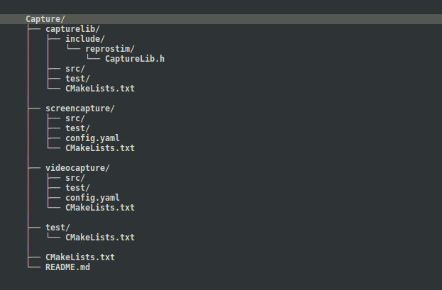
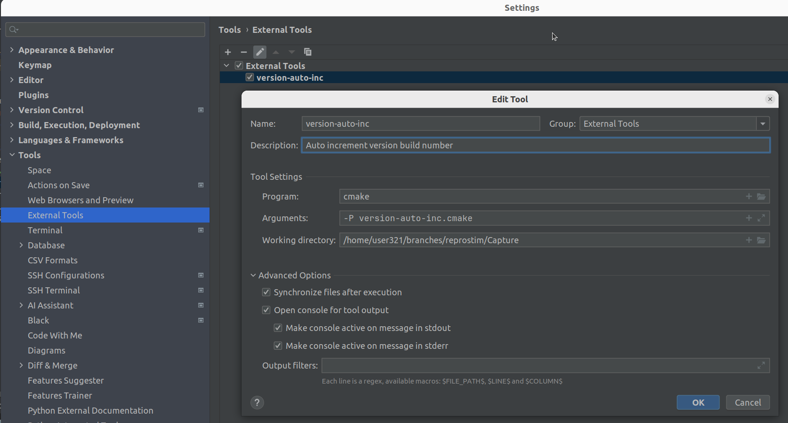

# ReproStim Capture

## Overview

Capture project is set of tools and utilities to capture video/audio signal with Magewell
USB Capture devices and save it to a file. It is a part of the ReproStim project.

## Dependencies

### On Debian:

    apt-get install -y ffmpeg libudev-dev libasound-dev libv4l-dev libyaml-cpp-dev libspdlog-dev catch2 v4l-utils libopencv-dev libcurl4-openssl-dev nlohmann-json3-dev cmake g++

Optionally, in case `con/duct` tool is used and `conduct_opts.enabled` is set to true in reprostim-videocapture `config.yaml`:

    apt-get install -y python3-pip
    python3 -m venv venv
    source venv/bin/activate
    pip install con-duct
    duct --version

### Project requirements:
   - OS Linux
   - g++ (C++20)
   - CMake 3.10+
   - Packages:
     - Magewell Capture SDK for Linux 3.3.1.1313
     - libv4l2
     - libv4l-dev
     - libudev-dev
     - libasound-dev
     - libyaml-cpp-dev
     - libspdlog-dev
     - libopencv-dev
     - libcurl4-openssl-dev
     - nlohmann-json3-dev
     - catch2
     - v4l-utils
     - ffmpeg
     - pip+con/duct (optional)

 

## Build

Capture uses CMake as build system. To build the project, run the following commands:

    cd Capture

    mkdir build
    cd build
    cmake ..
    make

## Installation

To install the project, once the build done, run the following command:

    cd Capture

    sudo cmake --install build

It will copy all necessary files to the `/usr/local/bin` location (`reprostim-videocapture`,
`reprostim-screencapture`, `reprostim-nosignal`).

## Project Structure

Capture project consists of the following components:
   - `capturelib` - shared static C++ library with common code across all utilities.
   - `screencapture` - project source code for "reprostim-screencapture" command-line 
utility. The program captures screenshots from Magewell USB Capture device and saves 
it as series of image files (*.png).
   - `videocapture` - project source code for "reprostim-videocapture" command-line
utility. The program captures video/audio streams from Magewell USB Capture device 
and saves it as video file (*.mkv).
    

Both utilities use `capturelib` as a shared library. 

All projects C++ code live in the `reprostim` namespace. So in general, the project 
structure looks like this:

## Versioning

Current model consists of two versions: explicit and implicit. Explicit version 
is specified in "version.txt" file and considered as the main one. Implicit version 
is a git describe tag reported in --version output as "Build tag".

All projects (capturelib, screencapture, videocapture) use the same versioning data.
It is stored in "version.txt" file in the root of the project. This is plain text file
with the following content: "{MAJOR}.{MINOR}.{PATCH}.{BUILD}". The file is used to 
set the version. Where {MAJOR}, {MINOR} and {PATCH} values should be set manually. While
{BUILD} value can be automatically updated by the build system in IDE or similar.

We also have CMake script "version-auto-inc.cmake" which can be used to increment 
build number in version file during development process:
    
        cd Capture

        cmake -P version-auto-inc.cmake

E.g. in CLion IDE, you can add "version-auto-inc.cmake" as External Tool under
"Settings -> Tools -> External Tools":

Then you can run it from the IDE to increment build number manually or integrate it
with build process (as pre-build hook) to increment build number automatically.

## Testing

In short words project uses CMake + CTest + Catch2 for unit testing. To run tests, 
build project and execute the following command:

    cd Capture/build
    ctest

Root project and each subproject have their own tests located in the "test" directory 
along with CMakeList.txt and C++ sources. 

Tests build process controlled by CMake option `CTEST_ENABLED`. If it is set to ON 
(default value), tests will be built. If it is set to OFF, tests will be skipped (can 
be useful for development in IDE under some circumstances to skip tests and reduce 
compilation time).
