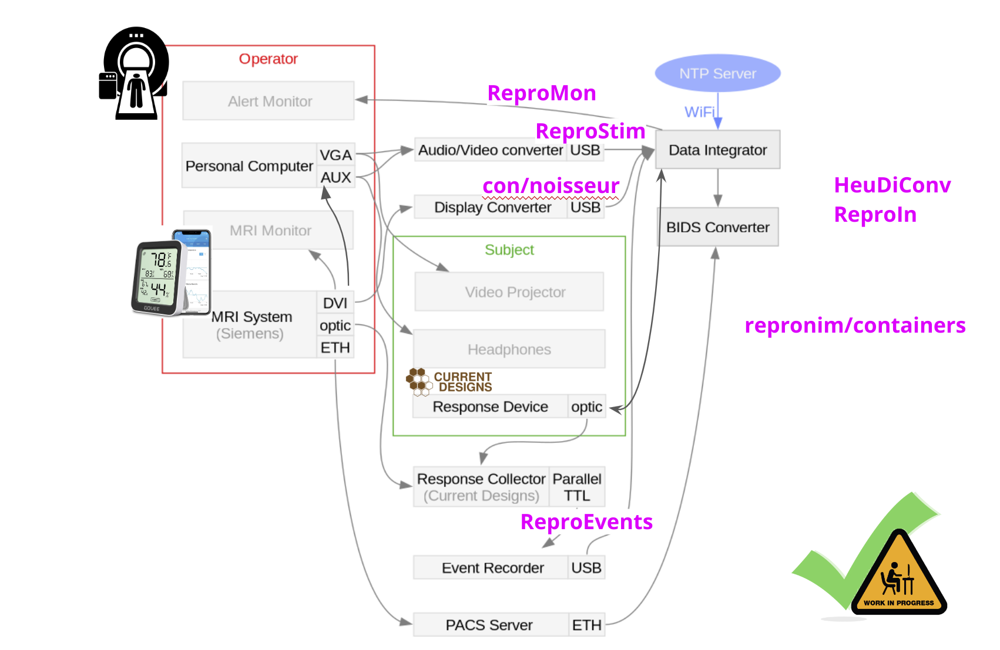
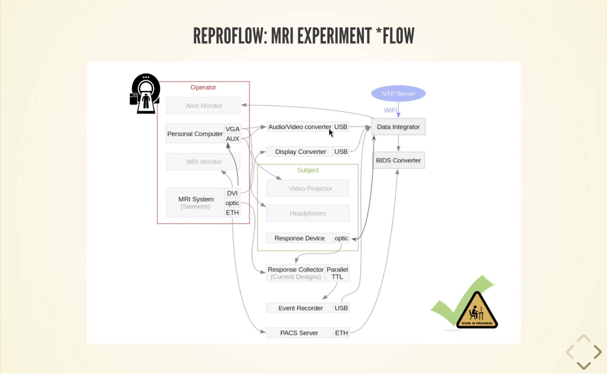
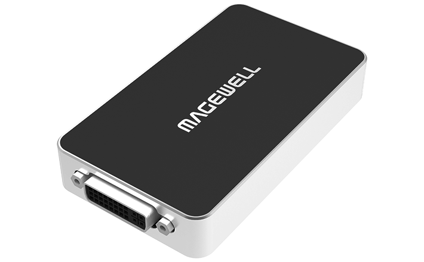
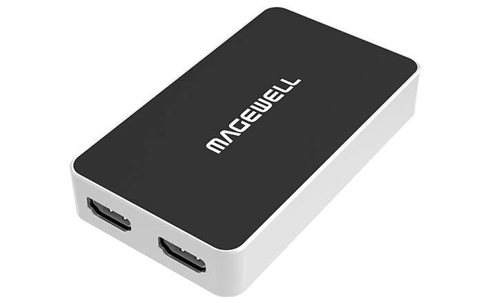

# Introduction

[](https://reprostim.readthedocs.io/en/latest/)
[](https://github.com/ReproNim/reprostim/actions/workflows/pytest.yml)
[](https://pypi.org/project/reprostim/)
[](https://anaconda.org/conda-forge/reprostim)
[](https://GitHub.com/ReproNim/reprostim/releases/)
[](https://raw.githubusercontent.com/ReproNim/reprostim/master/LICENSES/MIT.txt)

ReproStim is a video capture and recording suite for neuroimaging and
psychology experiments.  Its goal is to provide experimenters with a
complete record of audio and visual stimulation for every data collection
session by making it possible to easily collect high fidelity copies of the
actual stimuli shown to each subject in the form of video files that can be
stored alongside  behavioral or neuroimaging data in public repositories.
ReproStim is part of large ReproFlow process represented in the diagram below:


**Fig. 1:** [ReproNim ReproFlow Diagram, OHBM 2024 #2277](https://github.com/ReproNim/artwork/blob/master/posters/ReproFlow-OHBM2024-poster.svg)

**Note:** This is interactive [SVG diagram](docs/source/_static/images/reproflow.svg), so you can open it in separate
window and click on the boxes to see more

ReproStim provides for enhanced experimental reproducibility and a safeguard
against data loss in cases of data-collection irregularities.  Because
ReproStim provides an exact record of the actual stimuli delivered during
any given experimental session, it makes it possible to precisely reproduce
experimental sessions, even if the original trial sets were randomized and
precise trial details not recorded. In cases of experimental irregularities,
such as aborted fMRI runs, unexpected glitches in trial timing, or
programming errors that cause records of trial conditions to be lost,
valuable data (which can be especially costly in cases of fMRI of ECog, for
example) can be recoded and recovered using the audiovisual record provided
by ReproStim.


**Fig. 2:** [ReproFlow projects, automate collection of all related metadata (audio/video stimuli, events)](https://datasets.datalad.org/repronim/artwork/talks/webinar-2024-reproflow/#/10)

ReproStim requires minimal effort on behalf of investigators.  Once it is
setup as the default mode within a behavioral lab or neuroimaging center,
investigators can reap the benefits of ReproStim without any additional
effort on the part of individual experimenters.  When successfully set up,
ReproStim runs in the background, silently collecting, cataloging, and
storing all audio and visual stimulation delivered to experimental subjects.


**Fig. 3:** [SciOps from ReproNim/ ReproFlow (Webinar, Jun 2024) Video [31:30]](https://youtu.be/SZ96Q6pwJzQ?t=1890s)


# Development

## Hardware needed

Before using ReproStim you will need a minimum of the following
components:

1. Magewell USB Capture Plus device `MWC`

2. Stimulus control computer `SC` with A/V out to presentation device

3. External presentation device `EPD`

4. Video capture computer `VC` with USB-C port

5. Supporting cables including `A/V` splitter cables

### Simple setup schematic

Given a stimulus presentation computer `SC` that controls the content and
flow of the experimental presentation and presents `A/V` to experimental
subject on external monitor or projector `EPD`, the setup without ReproStim
would be something like:

#### 1. Schematic A.

```{mermaid}
graph LR
    SC[SC] -- A/V Out --> EPD[EPD]
```

With the addition of ReproStim, the setup will look like this:

#### 2. Schematic B.

```{mermaid}
graph LR
    SC[SC] -- A/V Out --> AVS[A/V Splitter]
    AVS --> EPD[EPD]
    AVS --> MWC[MWC]
    MWC -- USB-C --> VC[VC]
```

### Original set up without ReproStim

Most experimental setups include something like Schematic A, with a stimulus
control computer `SC` that sends `A/V` information to the experimental
subject. For example, in the Dartmouth Brain Imaging Center (DBIC),
experimenters can use their own laptop or a dedicated computer in the scan
control room for `SC`. The External Presentation Device for video (EPDv) in
the DBIC MRI suite is a projector that projects through the wall of the
shielded scan room to a rear-projection screen located at the back of the
MRI scanner bore; and the EPDa (audio) comprises MRI-safe headphones worn on
the subject's head.

The `A/V` out connections from `SC` can be any standard as long as you have the
appropriate adapters, dongles, etc. However, if your Video out does not
support embedded audio (e.g. VGA), then you will need a separate audio out
set of splitters and cables. The Magewell device has standard audio ports to
accommodate this eventuality.

Note: Missing from Schematics A and B, is any connection back to SC that
records subject response information. That's because ReproStim is not
interested in how the subject responses. If you like, imagine arrows pointing
from EPD to a "subject" node, and then more arrows pointing from the subject
node to some response input device (RID?) and back to SC for recording...
ReproStim will not interfere.

#### Magewell USB Capture Plus Family device

|  |  |
|:------------------------------------------------:|:-------------------------------------------------:|
|              *USB Capture DVI Plus*              |              *USB Capture HDMI Plus*              |


The current version of ReproStim has only been developed and tested for the
Magewell USB Capture devices `MWC` . Common Magewell devices include the
USB Capture HDMI Plus, USB Capture DVI Plus models. However, we anticipate
that it will be relatively painless to support at least all devices in the USB
Capture Plus Family. Information about these devices and supporting software
can all be found at [Magewell](https://www.magewell.com/capture/usb-capture)
website.

#### Video Capture computer `VC`, AKA ReproStim Server

The video capture computer `VC` does most of the work for ReproStim. The
software running on this computer runs as a service that is always on as
long as the computer is running, which is all the time. Therefore, I will
refer to VC also as the ReproStim server. In a nutshell, the server software
monitors the video signal coming from `SC` into `MWC`. If there is any video
coming over the connection, it gets recorded for posterity.

Current development of ReproStim, including our working setup at the DBIC,
uses a Linux box running Debian Linux. We anticipate that any Nix/Mac setup
running on a modern desktop will be amply sufficient as a ReproStim Server,
and should be relatively painless to configure. But `reprostim-videocapture`
utility is currently only available for Linux and not supported on Mac.

The current DBIC computer is a small-profile desktop that resides in the
control of the scan suite, quietly recording all video presented to all
subjects.


# Documentation
Full documentation is available at [Read the Docs](https://reprostim.readthedocs.io/en/latest/).

# Appendix

## A: ReproFlow Time Synchronization

As shown above on ReproFlow diagram `Fig. 1`, many devices and computers
are used in this workflow. Each system like MRI, Birch, ReproEvents,
video recorded by MWC, ReproIn server etc. has its own clock, and the clocks
are not synchronized. This is a problem for reproducibility, and strict
data matching. ReproStim provides some tools and APIs to help with this
problem.

We do calibration of the clocks monthly and store results in the
[reproflow-data-sync](https://github.com/ReproNim/reproflow-data-sync)
project. By now this is manual process, but we are working on automating it,
so that the time synchronization is done automatically, and the results
are stored in the same dataset.

The `timesync-stimuli` command is used to generate test A/V output
with embedded timecodes (QR and audiocode).

Also `qr-parse` command is used to parse the QR/audio codes from the video
recordings and convert it to JSONL format.

[reproflow-data-sync/code](https://github.com/ReproNim/reproflow-data-sync/tree/master/code)
project provides tools to match clocks between different devices/swimlanes
like `DICOMs`, `Birch`, `ReproEvents`, `PsychoPy`, `QR/audio` codes etc.
As result global `tmap` table is populated with time offsets between
different devices. This table is used to match the time of events
between different devices with `repronim_timing` API. Probably some of
this code with time will be migrated/moved to ReproStim project.


## B: ReproFlow Projects

- [BIDS](https://github.com/bids-standard) - brain imaging data structure standard.
- [Birch](https://wiki.curdes.com/bin/view/CdiDocs/BirchUsersManual) - birch interface documentation.
- [CON](https://centerforopenneuroscience.org/) - center for open neuroscience homepage.
- [con/noisseur](https://github.com/con/noisseur) - system for automated verification of entered/displayed information (on another computer).
- [containers/repronim](https://github.com/ReproNim/containers/tree/master/images/repronim) - repronim containers binary `distribution` for reproducible neuroimaging.
- [containers/repronim-reprostim](https://github.com/ReproNim/reprostim/tree/master/containers/repronim-reprostim) - reprostim containers metadata and tools to generate/build binaries.
- [DataLad](https://www.datalad.org/) - distributed data management free and open source tool.
- [DBIC](https://www.dartmouth.edu/dbic/) - Dartmouth brain imaging center.
- [DICOM](https://www.dicomstandard.org/) - digital imaging and communications in medicine standard.
- [HeuDiConv](https://heudiconv.readthedocs.io/en/latest/) - heuristic-centric DICOM converter.
- [Magewell USB Capture](https://www.magewell.com/capture/usb-capture) - Magewell USB Capture devices.
- [MWCapture SDK](https://www.magewell.com/sdk) - Magewell USB Capture SDK and APIs.
- [NeuroDebian](https://neuro.debian.net/) - ultimate neuroscience software platform.
- [NTP](https://en.wikipedia.org/wiki/Network_Time_Protocol) - network time protocol wiki.
- [ReproEvents](https://github.com/ReproNim/reprostim/tree/master/Events) - events listener server and micropython-based firweware for Raspberry Pi event relay devices.
- [reproflow-data-sync](https://github.com/ReproNim/reproflow-data-sync) - DataLad dataset with all samples of recorded `ReproEvents`, `ReproStim`, etc. data for purpose of calibration and establishing processing pipelines.
- [ReproIn](https://github.com/ReproNim/reproin) - setup for automatic generation of shareable, version-controlled BIDS datasets from MR scanners.
- [ReproMon](https://github.com/ReproNim/repromon) - service to monitor data acquisition to alert if anything goes wrong in ReproFlow.
- [ReproStim](https://github.com/ReproNim/reprostim) - automated capture of audio-visual stimuli into BIDS datasets.
- [reprostim-capture](https://github.com/ReproNim/reprostim/tree/master/src/reprostim-capture) - set of tools and utilities to capture video/audio signal with Magewell USB Capture devices and save it to a file. It is a part of the ReproStim project.
